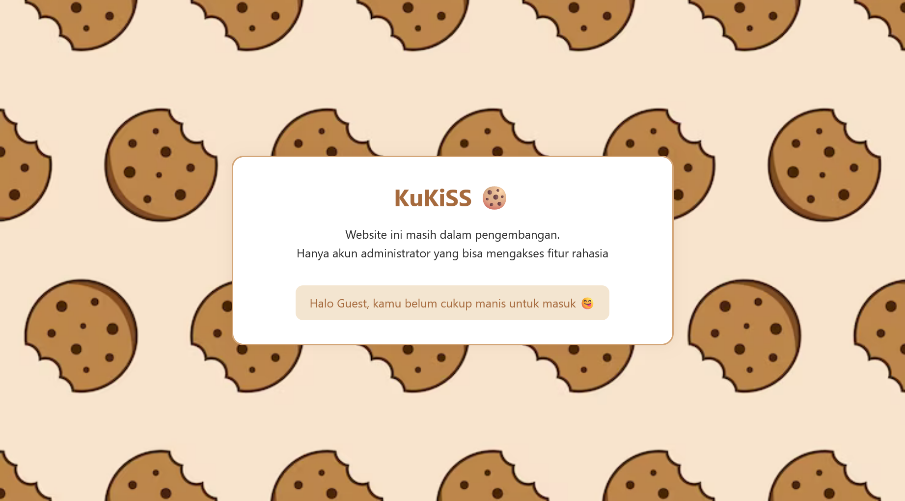
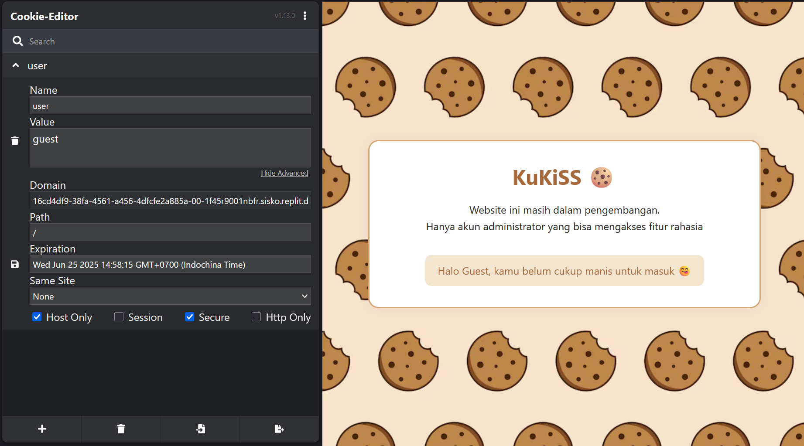
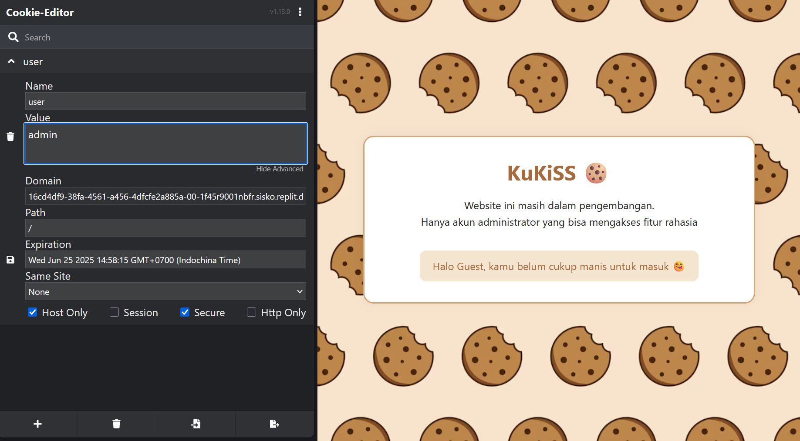
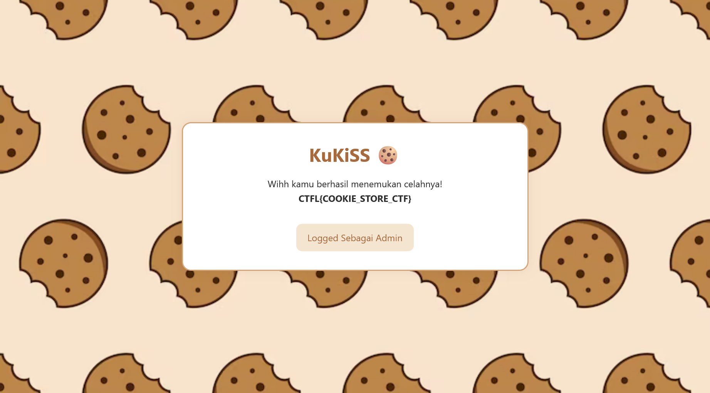

# 🍪 KuKiSS — Kunci Kuki Sistem Sederhana

> Web CTF Challenge | by [ctflabs-id](https://github.com/ctflabs-id)


---

## 🎯 Tentang KuKiSS

**KuKiSS (Kunci Kuki Sistem Sederhana)** adalah sebuah tantangan CTF Web-Exploitation di mana kamu harus mencari "kue rahasia" di situs toko kue yang sedang dalam pengembangan. Sayangnya, sang developer lupa mengamankan cookie-nya... dan kamu bisa memanfaatkannya untuk mendapatkan flag!

---

## 🕵️ Skema Tantangan

Situs web akan secara default memberikan cookie `user=guest` ke setiap pengunjung.

Namun, jika kamu berhasil mengubah cookie tersebut menjadi `user=admin`, maka sistem akan menampilkan:

```html
Wihh kamu berhasil menemukan celahnya!
CTFL{CODE_CTF}
```

---

## ⚙️ Cara Kerja CTF

1. Akses website KuKiSS
2. Periksa cookie browser kamu (otomatis bernilai `guest`)
3. Ubah cookie menjadi `admin` dengan ekstensi browser
4. Refresh halaman dan lihat apakah kamu berhasil mendapatkan "kue"

---

## 🚀 Instalasi Lokal (dengan Node.js)

```bash
git clone https://github.com/yourteam/kukiss-ctf.git
cd kukiss-ctf
npm install
node server.js
```

Buka browser ke `http://localhost:3000` dan mulai eksplorasi!

---

<details><summary><h2> 🖼️ Step-by-Step Eksploitasi - (Spoiler Allert)</h2></summary>


1. Masuk ke halaman utama&#x20;
</img>
2. Gunakan ekstensi seperti Cookie Editor
</img>
3. Ubah nilai cookie dari `guest` ke `admin`&#x20;
</img>
4. Refesh page
</img>
</details>


---

## 🎓 Tujuan Tantangan Ini

1. Belajar dasar eksploitasi cookies di aplikasi web
2. Memahami pentingnya validasi sisi server
3. Mengenal logika auth bypass dengan manipulasi cookies

---

## ⚠️ Disclaimer

Challenge ini dibuat hanya untuk **edukasi dan simulasi keamanan siber**. Jangan gunakan teknik serupa terhadap sistem yang tidak kamu miliki atau tidak diizinkan.

---
🤝 Kontribusi Pull request & issue welcome via: ctflabs-id/

🧠 Maintained by

    GitHub: @ctflabs-id
    Website: ctflabsid.my.id

